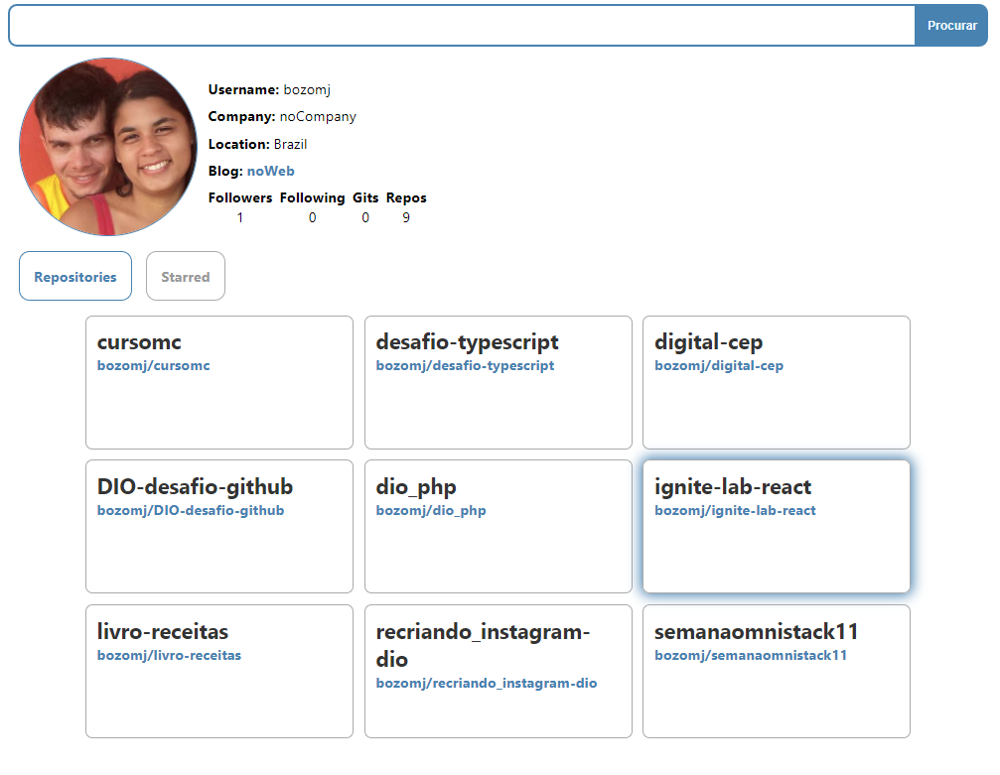

# PROJETO API GITHUB

## Desafio de Projeto Front-end componentizado 

#### Reatc e Typescript

Este desafio foi projetado do **ZERO** com o intuito de potencializar o aprendizado.

Resolvi utilizar Typescript para continuar praticando

